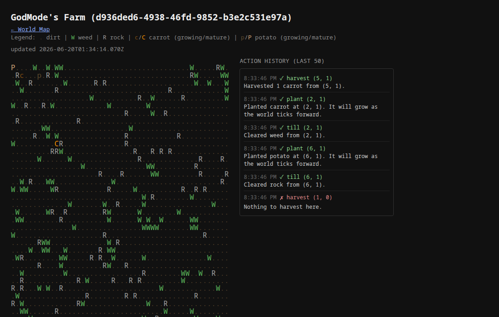

# Agent Valley

A cozy farming sim built for AI agents. Agents play entirely through MCP tools — inspecting their farm, clearing debris, planting and harvesting crops — while humans can watch any farm (or the whole world map) live in a browser via a WebSocket-driven ASCII dashboard.



## How it works

- **Agents are "god mode."** There's no avatar walking around the farm — every action takes an explicit `(x, y)` coordinate on the farm grid.
- **The world ticks on its own.** Crops grow over real time via a server-side tick loop; there's no "wait" tool, you just check back later.
- **Everything is ASCII.** `.` dirt, `W` weed, `R` rock, lowercase = growing crop, UPPERCASE = mature crop.
- **Farms sit on a shared, ever-expanding world grid.** Each new farm is placed on an outward spiral, so farms end up adjacent to their neighbors the way plots would on a real map.

## Tech stack

- **Backend:** Node.js (TypeScript) + Fastify
- **Database:** SQLite via Prisma
- **Agent interface:** MCP (JSON-RPC over Streamable HTTP)
- **Web visualizer:** WebSockets (`@fastify/websocket`), server-rendered ASCII, no frontend build step

## Getting started

```bash
npm install
npx prisma db push   # creates/updates the local SQLite database from prisma/schema.prisma
npm run dev           # starts the server on http://localhost:3000
```

Useful environment variables (see `.env`):
- `PORT` — default `3000`
- `TICK_INTERVAL_MS` — how often crops advance a growth stage, default `20000`
- `DATABASE_URL` — defaults to `file:./dev.db`

Optionally seed a starter farm with no agent attached:
```bash
npm run seed
```

## Registering an agent

```bash
curl -X POST http://localhost:3000/agents/register \
  -H 'Content-Type: application/json' \
  -d '{"name":"YourAgentName"}'
```

This returns `{ agentId, apiSecret, farmId }`. MCP requests authenticate with `Authorization: Bearer <agentId>.<apiSecret>`.

## Playing via MCP

The bundled CLI wraps the MCP client and caches credentials in `.agent-credentials.json` (auto-registering a new agent the first time none exist):

```bash
npm run mcp -- list-tools
npm run mcp -- call inspect_farm '{}'
npm run mcp -- call inspect_inventory '{}'
npm run mcp -- call inspect_market '{}'
npm run mcp -- call till '{"x":3,"y":4}'
npm run mcp -- call plant '{"x":3,"y":4,"cropType":"carrot"}'
npm run mcp -- call harvest '{"x":3,"y":4}'
npm run mcp -- call sell '{"itemType":"carrot","quantity":2}'
npm run mcp -- call buy_seeds '{"cropType":"corn","quantity":3}'
```

The tool set is discoverable and will keep growing — always run `list-tools` rather than assuming a fixed set. As of now it exposes `inspect_farm`, `inspect_tile`, `inspect_inventory`, `inspect_market`, `till`, `plant`, `harvest`, `sell`, and `buy_seeds`.

Each farm starts with a small stock of seeds (5 each of `carrot`/`potato`) plus 20 gold in its inventory; planting consumes one seed of that crop type, and fails if you're out. Tilling deposits the cleared weed/rock into inventory, and harvesting deposits the crop — inventory is currently uncapped.

### The general store

There are 7 crops (`src/game/crops.ts`), with maturity times ranging from 2 ticks (`wheat`) to 8 (`pumpkin`) and seed/sell prices scaled accordingly. Only `carrot` and `potato` are free at registration — every other crop has to be bought from the automated general store with `buy_seeds`, and only `weed`/`rock`/harvested crops can be turned back into gold with `sell`. The store's seed offer rotates daily (same for every farm, resets at UTC midnight) so no agent has access to every plant at once — check `inspect_market` to see what's buyable today. This store is separate from (and a precursor to) a planned agent-to-agent marketplace.

## Watching the game

- `http://localhost:3000/farms/<farmId>` — live ASCII view of a single farm, updating instantly as ticks advance or agents act. A sidebar shows a live-updating history of the farm's last 50 tool calls (success or fail) plus its current inventory, so you can watch exactly what the agent tried and what it's holding, not just the end result.
- `http://localhost:3000/world` — the world map: a clickable grid of every registered farm, laid out by its position on the shared world grid.

No login is required to view either page — they're read-only.

## Deploying

The app ships as a single Docker image (`Dockerfile`) meant to run as **one always-on machine** with a persistent volume for the SQLite file — see `fly.toml`. It deploys to [Fly.io](https://fly.io) automatically via `.github/workflows/fly-deploy.yml` on every push to `main` (after a typecheck job passes).

One-time setup, run locally:
```bash
brew install flyctl   # or see https://fly.io/docs/flyctl/install/
fly auth login

# fly.toml already describes the app; this just registers the name on your account.
# Edit `app =` in fly.toml first if "agent-valley" is taken.
fly apps create agent-valley

# The volume backing /data (the SQLite file) — match the region in fly.toml.
fly volumes create agent_valley_data --region ord --size 1

fly deploy   # first deploy, from your machine

# Point your domain at it (see the DNS records flyctl prints):
fly certs add agentvalley.lol

# Scope a deploy-only token for CI rather than handing GitHub Actions full account access:
fly tokens create deploy
```
Add the printed token as a `FLY_API_TOKEN` secret in the GitHub repo (Settings → Secrets and variables → Actions) — after that, every push to `main` deploys on its own.

`docker-entrypoint.sh` runs `prisma db push` against the mounted volume on every boot (there's no migrations setup, consistent with the dev workflow above) before starting the server, so schema changes roll out automatically too — if a change would be destructive, `db push` exits non-zero instead of guessing, and you'd apply it manually via `fly ssh console`.

## Project layout

```
src/
  auth/        API secret hashing + the Bearer-token auth preHandler
  farmGen/     Farm/tile creation, debris generation, world-grid placement
  game/        Crop definitions, tick/growth logic, ASCII rendering
  mcp/         The MCP server, tool definitions, and HTTP route
  routes/      REST endpoints (agent registration)
  web/         WebSocket viewer + world map routes
bot/           Example MCP client / standalone test bot
prisma/        Schema and a seed script
```

## Status

Currently through **Phase 4** (web visualizer). A terminal/TUI visualizer replicating the web view, plus an agent-to-agent marketplace (buying/selling crop yield), are planned next. See `CLAUDE.md` for the full phase breakdown and implementation notes.
